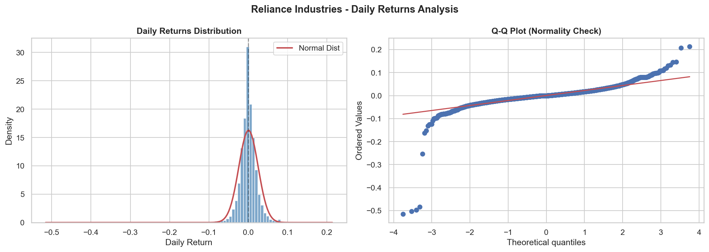
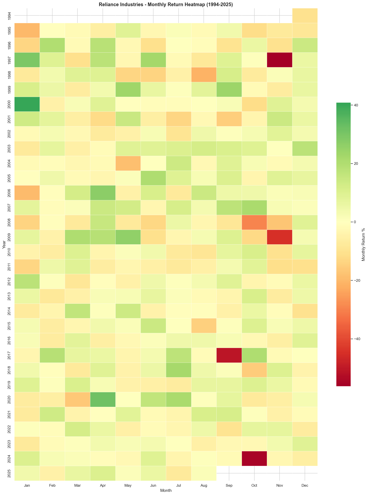
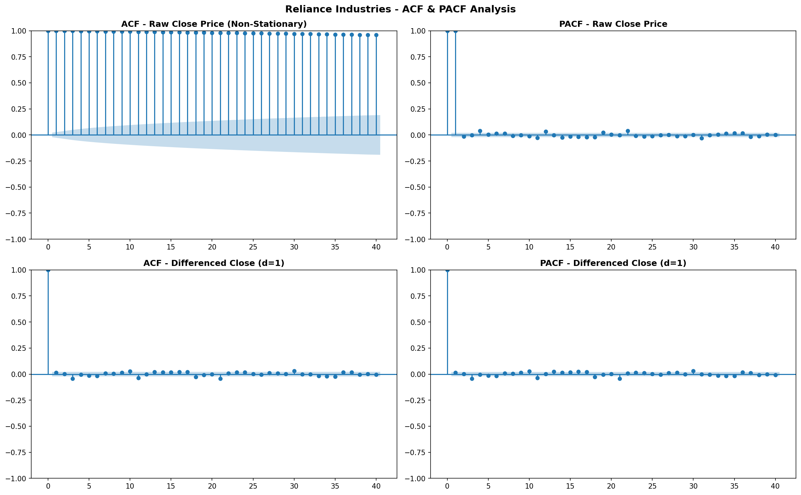
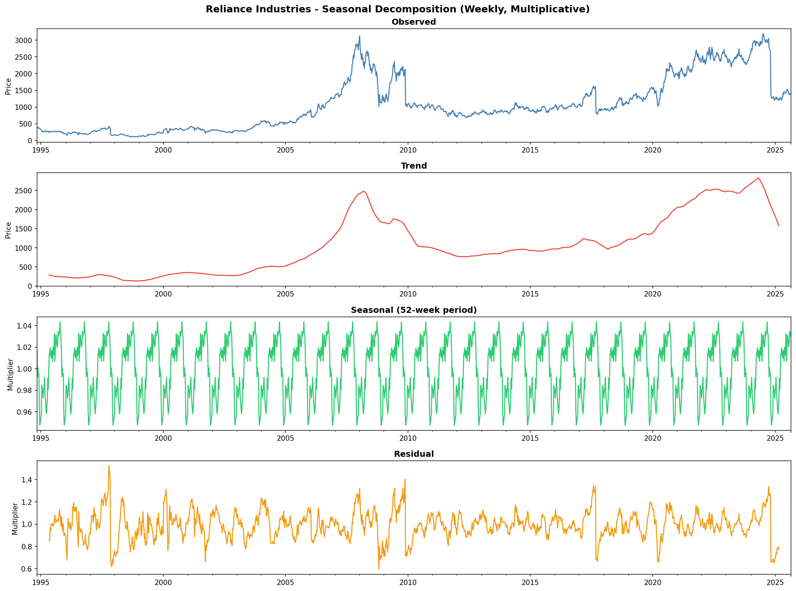
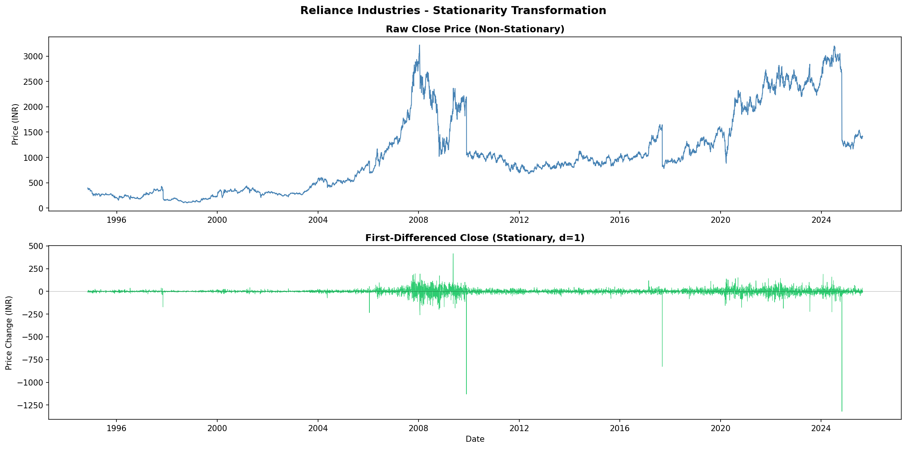

# 📈 Reliance Industries — Stock Market Analysis & Forecasting (1994–2025)

<div align="center">

> **30+ years of NSE data. 8,037 trading days. One complete end-to-end analysis.**


</div>

---

## 🧠 Why This Project Exists — The Problem We Solved

Most retail investors and finance students who want to analyze Reliance Industries stock face a fragmented workflow:

- Manually downloading data from multiple sources
- Cleaning messy, duplicate-ridden historical CSVs by hand
- Using separate tools for charting, indicators, and forecasting
- No single place to explore 30+ years of price history interactively

**This project solves all of that in one click.** It is a complete, self-contained stock analysis pipeline that goes from raw data → cleaned dataset → 16 professional charts → ARIMA forecast → interactive Streamlit dashboard, entirely automated in 5 Python scripts.

---

## ⚡ What Makes This Unique & Time-Saving

| Feature | Traditional Approach | This Project |
|---------|---------------------|--------------|
| **Data Cleaning** | Hours of manual Excel work | Automated — removes 189 duplicates, validates OHLCV, forward-fills holidays |
| **Technical Indicators** | Separate library calls, manual tuning | 6 indicators (SMA, EMA, RSI, BB, MACD) computed in one script |
| **Statistical Testing** | Copy-paste from textbooks | ADF, ACF/PACF, Shapiro-Wilk, decomposition — all automated with interpretation |
| **Forecasting** | Manual ARIMA order selection | Grid search over 16 ARIMA(p,1,q) combinations, auto-selects best by AIC |
| **Visualization** | Static Excel charts | 16 interactive Plotly + Matplotlib charts |
| **Dashboard** | Requires heavy frontend dev | One-command Streamlit app with 10+ controls |
| **Time to reproduce** | 3–5 days | < 5 minutes (run 5 scripts) |

---

## 📊 Key Results and Insights

| Metric | Value | Insight |
|--------|-------|---------|
| 📅 Dataset Coverage | Nov 1994 – Aug 2025 | 8,037 trading days |
| 💰 Total Return | ~257% | From ₹396 → ₹1,413 (peak ₹3,221) |
| 🏆 Best Year | 2007 | **+127.0%** (Reliance's golden era) |
| 📉 Worst Year | 2008 | **-56.7%** (Global Financial Crisis) |
| 📊 Avg Volatility (30d) | 33.2% annualized | Significantly higher than Nifty-50 |
| 🔔 Return Skewness | -4.06 (left-tailed) | More extreme drops than gains |
| 🐋 Excess Kurtosis | 91.3 | Black swans happen FAR more often than normal distribution predicts |
| 🤖 Best Forecast Model | ARIMA(2,1,2) | AIC = 11,913.08 |
| 📈 All-Time High | ₹3,220.85 | Oct 2021 |
| 📉 Stationarity (raw) | p = 0.29 → **Non-stationary** | d = 1 required |

---

## 🗂️ Project Structure

```
reliance-stock-analysis/
├── data/
│   ├── reliance_raw.csv                  # Original 1994-2025 dataset
│   └── reliance_cleaned.csv              # 8,037 rows × 33 columns (cleaned + all indicators)
├── scripts/
│   ├── 01_data_cleaning.py               # Load → Dedupe → Validate → Feature engineer → Merge RSI/PE
│   ├── 02_eda.py                         # 7 EDA charts + decade statistics report
│   ├── 03_technical_indicators.py        # SMA, EMA, RSI, Bollinger Bands, MACD → 4 charts
│   ├── 04_stationarity_testing.py        # ADF tests, ACF/PACF, decomposition → 3 charts + report
│   └── 05_arima_forecasting.py           # Grid search, model fit, 30/60d forecasts → 3 charts + 4 CSVs
├── outputs/
│   ├── plots/                            # 16 charts (10 HTML + 6 PNG)
│   └── reports/                          # 7 reports (CSVs + TXT)
├── app.py                                # Streamlit interactive dashboard
├── requirements.txt
└── README.md
```

---

## 📸 Generated Charts — Visual Gallery

### Phase 2 — Exploratory Data Analysis

| Chart | Preview | Type | What It Shows |
|-------|---------|------|---------------|
| **30-Year Price Trend** | [▶ Open Interactive](https://mahantesh-075.github.io/Reliance-Industries-Stocks-Analysis/ril_30yr_price.html) | Plotly HTML | Full price history with Dot-com, GFC, COVID, Jio annotations |
| **Annual Returns** | [▶ Open Interactive](https://mahantesh-075.github.io/Reliance-Industries-Stocks-Analysis/ril_annual_returns.html) | Plotly HTML | Year-by-year green/red bar chart |
| **Price & Volume** | [▶ Open Interactive](https://mahantesh-075.github.io/Reliance-Industries-Stocks-Analysis/ril_price_volume.html) | Plotly HTML | Dual-axis price + color-coded volume |
| **Rolling Volatility** | [▶ Open Interactive](https://mahantesh-075.github.io/Reliance-Industries-Stocks-Analysis/rolling_volatility.html) | Plotly HTML | 30-day & 90-day annualized volatility bands |
| **Returns Distribution** | 👇 Static PNG below | Matplotlib PNG | Histogram + Q-Q plot |
| **Monthly Return Heatmap** | 👇 Static PNG below | Seaborn PNG | Year × Month return heatmap (30 years) |

#### Returns Distribution (Histogram + Q-Q Plot)


#### Monthly Return Heatmap (1994–2025)


---

### Phase 3 — Technical Indicators

| Chart | Link | Covers |
|-------|------|--------|
| **Candlestick + Moving Averages** | [▶ Open Interactive](https://mahantesh-075.github.io/Reliance-Industries-Stocks-Analysis/candlestick_ma.html) | SMA-50, SMA-200, EMA-20 overlaid on 2023–2025 OHLC |
| **Bollinger Bands** | [▶ Open Interactive](https://mahantesh-075.github.io/Reliance-Industries-Stocks-Analysis/bollinger_bands.html) | Upper/Lower bands, squeeze zones (2022–2025) |
| **RSI-14** | [▶ Open Interactive](https://mahantesh-075.github.io/Reliance-Industries-Stocks-Analysis/rsi_chart.html) | RSI with overbought (70) / oversold (30) shaded zones |
| **MACD (12,26,9)** | [▶ Open Interactive](https://mahantesh-075.github.io/Reliance-Industries-Stocks-Analysis/macd_chart.html) | MACD line, signal line, histogram with buy/sell signals |

---

### Phase 4 — Stationarity Testing

| Chart | Preview | What It Proves |
|-------|---------|---------------|
| **ACF & PACF** | 👇 Static PNG below | Confirms non-stationarity in raw price; stationarity after d=1 |
| **Seasonal Decomposition** | 👇 Static PNG below | Trend + Seasonality + Residual (weekly, multiplicative) |
| **Stationarity Comparison** | 👇 Static PNG below | Raw close vs first-differenced side-by-side |

#### ACF & PACF Plots (Raw vs Differenced)


#### Seasonal Decomposition


#### Stationarity Transformation (Raw → Differenced)


---

### Phase 5 — ARIMA/SARIMA Forecasting

| Chart | Link | What It Shows |
|-------|------|--------------|
| **ARIMA Forecast vs Actual** | [▶ Open Interactive](https://mahantesh-075.github.io/Reliance-Industries-Stocks-Analysis/arima_forecast_vs_actual.html) | Train/test split with prediction confidence bands |
| **30-Day Future Forecast** | [▶ Open Interactive](https://mahantesh-075.github.io/Reliance-Industries-Stocks-Analysis/arima_30day_forecast.html) | Next 30 trading days with 95% CI |
| **60-Day Future Forecast** | [▶ Open Interactive](https://mahantesh-075.github.io/Reliance-Industries-Stocks-Analysis/arima_60day_forecast.html) | Next 60 trading days with 95% CI |

---

## 🤖 ARIMA Grid Search Results

All 16 candidate models tested on training data (2020–2024):

| Model | AIC | BIC | Selected? |
|-------|-----|-----|-----------|
| ARIMA(0,1,0) | 11914.41 | 11919.48 | |
| ARIMA(0,1,1) | 11916.28 | 11926.43 | |
| ARIMA(2,1,2) | **11913.08** | 11938.44 | ✅ **Best (Lowest AIC)** |
| ARIMA(1,1,0) | 11916.28 | 11926.42 | |
| SARIMA(2,1,2)×(1,1,1,5) | AIC=11801.41 | — | (Higher RMSE on test) |

---

## 🚀 How to Run (5 Minutes to Full Analysis)

### 1. Install Dependencies
```bash
pip install -r requirements.txt
```

### 2. Run All Analysis Scripts
```bash
python scripts/01_data_cleaning.py     # ~5 sec  — Data cleaning
python scripts/02_eda.py               # ~15 sec — 7 EDA charts
python scripts/03_technical_indicators.py  # ~10 sec — Indicator charts
python scripts/04_stationarity_testing.py  # ~20 sec — Statistical tests
python scripts/05_arima_forecasting.py     # ~2 min  — ARIMA grid search
```

### 3. Launch Interactive Dashboard
```bash
streamlit run app.py
```
Then open **http://localhost:8501** in your browser.

---

## 🎛️ Dashboard Features

The Streamlit dashboard (`app.py`) provides:

| Panel | Controls | Description |
|-------|----------|-------------|
| **Header KPI Cards** | Auto-updated | Start price, Latest price, Total return %, ATH, Avg volume |
| **Main Price Chart** | Date slider, Candlestick/Line/Area toggle | Full interactive price history |
| **Overlay Controls** | SMA-50, SMA-200, EMA-20, Bollinger Bands, Volume | Toggle indicators on/off |
| **RSI Panel** | Always-on | RSI-14 with overbought/oversold shaded zones |
| **Forecast Panel** | 30-Day / 60-Day dropdown | ARIMA forecast with 95% CI bands |
| **Annual Returns Tab** | Filterable by date range | Green/red year-by-year bar chart |
| **Volatility Tab** | Filterable by date range | 30-day & 90-day rolling volatility |
| **Data Explorer Tab** | Last 50 rows | Formatted raw OHLCV + returns table |

---

## 🛠️ Tech Stack

| Layer | Libraries |
|-------|-----------|
| Data Processing | `pandas`, `numpy` |
| Visualization | `plotly`, `matplotlib`, `seaborn`, `mplfinance` |
| Statistical Analysis | `statsmodels`, `scipy` |
| Machine Learning | `scikit-learn` |
| Dashboard | `streamlit` |
| Image Export | `kaleido` |

---
Dashboard Link | [Dashboard](https://mahantesh-075.github.io/Reliance-Industries-Stocks-Analysis/dashboard.html/)

## 📖 Decade-Wise Analysis

| Decade | Avg Daily Return | Avg Volatility (30d) | Total Period Return | Notable Events |
|--------|-----------------|---------------------|---------------------|----------------|
| 1990s | +0.01% | 44.5% | -41.1% | Asian Financial Crisis, BSE market structure changes |
| 2000s | +0.10% | 37.4% | +333.3% | Jamnagar refinery, Reliance retail expansion, GFC |
| 2010s | +0.03% | 26.3% | +38.8% | Jio launch (2016), rights issue, Rights Issue boom |
| 2020s | +0.02% | 27.8% | -6.4% | COVID crash + recovery, ATH 2021, correction 2024–25 |

---

## ⚠️ Disclaimer

This project is for **educational and analytical purposes only**. It does not constitute financial advice. Past performance does not guarantee future results. Stock market investments are subject to risk. Always consult a qualified financial advisor before making investment decisions.

---

<div align="center">

Built with ❤️ using Python • Streamlit • Plotly • Statsmodels

**Data Source:** NSE (National Stock Exchange) | 1994–2025

</div>
